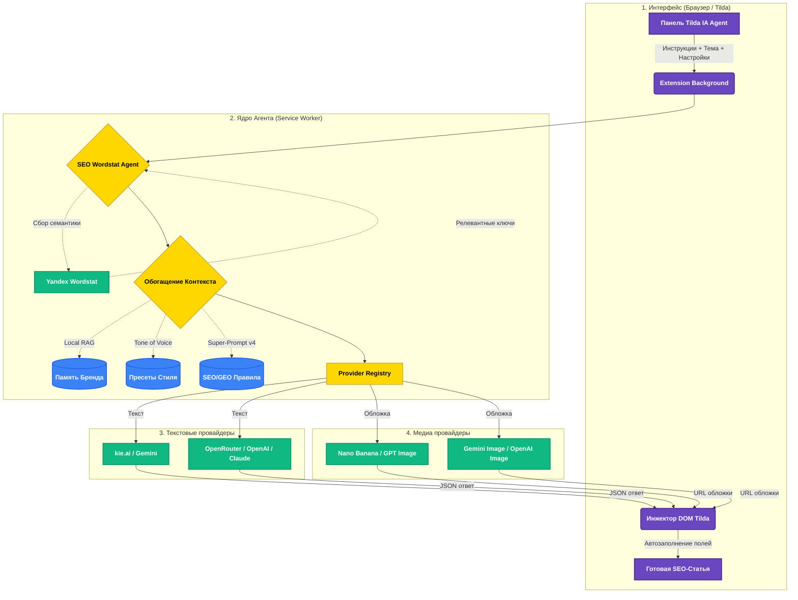

<div align="center">
  
</div>

<h1 align="center">Tilda AI Agent Feeds v1.0</h1>

<p align="center">
  <b>Ультимативное Chrome-расширение для генерации "Jaw-Dropping" статей и обложек в Tilda Потоках.<br>Мульти-провайдерная архитектура: используйте любую нейросеть для текста и картинок независимо.</b>
</p>

<div align="center">
  
  
  
  
  
</div>

<div align="center">
  
  
  
  
  <a href="https://t.me/maya_pro"></a>
</div>

---

## 🚀 Особенности

- ✍️ **Мульти-провайдерная генерация текста:** Выбирайте любую нейросеть для написания статей — **Gemini, GPT-4o, Claude, OpenRouter (500+ моделей)** или kie.ai. Провайдер текста и изображений настраиваются **независимо**.
- 🎨 **Мульти-провайдерная генерация обложек:** **Nano Banana Pro, Gemini Image, GPT Image, OpenAI Image** — используйте разные модели для текста и картинок одновременно.
- 🪄 **Всё по одной кнопке:** Одно нажатие "Заполнить всё" — и ИИ сам пишет текст, генерирует обложку и **автоматически заполняет все поля в Tilda** (Заголовок, Описание, SEO-Title, SEO-Description, Ключевики, ЧПУ-slug, Теги, Автор и Alt-текст картинки).
- 🧠 **Локальный RAG (Память бренда):** Расширение запоминает факты о вашей компании и автоматически подмешивает их в тексты.
- 🗣 **Tone of Voice:** Встроенные пресеты тона (Официальный, Дружелюбный, Кликбейт, Обучающий, Продающий).
- ⚙️ **SEO-Агент (Wordstat):** Подключается к Яндекс.Вордстат, анализирует семантику, подбирает ключи и автоматически вписывает их без переспама!
- 🗂 **История генераций:** Никогда не теряйте свои удачные промпты. Вы всегда можете скопировать их из встроенного журнала.
- ⚡ **Super-Prompt v4:** Встроенная хардкор-инструкция для получения статей топового уровня, сразу готовых под SEO и GEO (Generative Engine Optimization).
- 🛡 **Надёжность:** Автоматический retry с exponential backoff, обработка rate limit (429), таймауты, восстановление сломанного JSON от AI, логирование ошибок.

---

## 🔌 Поддерживаемые провайдеры

### Текст (5 провайдеров)

| Провайдер | Модели | Примечание |
|---|---|---|
| **kie.ai** | Gemini 3 Pro | По умолчанию. Один ключ для текста и картинок |
| **Google Gemini** | Gemini 2.5 Flash, 2.5 Pro, 2.0 Flash | Официальный API. В РФ нужен VPN |
| **OpenRouter** | 500+ моделей (GPT-4o, Claude, Llama, Mistral…) | Единый ключ ко всем моделям |
| **OpenAI** | GPT-4o, GPT-4.1, GPT-4o Mini, o3 Mini | Прямой доступ к OpenAI |
| **Anthropic** | Claude Sonnet 4, Claude 3.5 Sonnet/Haiku | Прямой доступ к Claude |

### Изображения (4 провайдера)

| Провайдер | Модели | Примечание |
|---|---|---|
| **kie.ai (Nano Banana)** | Nano Banana Pro | По умолчанию. Коллажные обложки |
| **kie.ai (GPT Image)** | GPT Image 1.5 (Text→Image, Image→Image) | Через kie.ai |
| **Google Gemini Image** | Gemini 2.0 Flash Image | Официальный API |
| **OpenAI GPT Image** | GPT Image 1 | Прямой доступ к OpenAI |

> **Провайдеры текста и изображений настраиваются независимо.** Например: OpenRouter (Claude) для текста + Nano Banana Pro для обложек.

---

## 🛠 Установка (Режим Разработчика)

1. **Скачайте** (или клонируйте) этот репозиторий себе на компьютер.
2. Откройте браузер Chrome и перейдите по адресу: `chrome://extensions/`.
3. Включите **«Режим разработчика»** (тумблер в правом верхнем углу).
4. Нажмите **«Загрузить распакованное расширение»** и выберите папку, в которой лежит файл `manifest.json`.
5. Убедитесь, что в корне проекта лежит файл **`tilda-kovcheg.png`** (он используется как иконка).

---

## 🔑 Настройка API

1. Нажмите на иконку расширения в панели Chrome 🧩.
2. **Провайдер текста:** Выберите провайдер, вставьте API-ключ, выберите модель. Нажмите **«Сохранить»**.
3. **Провайдер изображений:** Выберите провайдер, вставьте API-ключ (может быть тот же или другой), выберите модель. Нажмите **«Сохранить»**.
4. Нажмите **«Проверить»** чтобы убедиться, что ключи рабочие.

### Где получить ключи

| Провайдер | Ссылка |
|---|---|
| kie.ai | [kie.ai](https://kie.ai) |
| Google AI Studio | [aistudio.google.com](https://aistudio.google.com/) |
| OpenRouter | [openrouter.ai/keys](https://openrouter.ai/keys) |
| OpenAI | [platform.openai.com/api-keys](https://platform.openai.com/api-keys) |
| Anthropic | [console.anthropic.com](https://console.anthropic.com/) |

---

## 💻 Как использовать

1. Зайдите в панель управления **Tilda → Потоки** (редактор поста).
2. На экране автоматически появится стильная плавающая панель **«Tilda IA Agent»**.
3. **Промпт генерации (Инструкции):** Введите, как именно писать статью (или выберите ваш сохраненный пресет).
4. **Тема или вводная информация:** Скопируйте сюда сырой текст, тему, факты или наброски.
5. Настройте параметры генерации, SEO, Wordstat и Обложку (если необходимо).
6. Нажмите **«Заполнить всё»** — и смотрите магию! Агент самостоятельно напишет статью, подберет обложку и **автоматически расставит всё по нужным полям Tilda** (Заголовок, Описание, SEO-теги, Текст, Изображение).

---

## 🧩 Архитектура



---

## 📁 Структура проекта

```
├── manifest.json                    # Chrome Extension Manifest V3
├── background.js                    # Service worker: оркестрация, API routing
├── package.json                     # Dev-зависимости (ESLint, Prettier)
│
├── lib/
│   ├── constants.js                 # Все ключи хранилища, URL, ID провайдеров
│   ├── storage.js                   # Типизированная обёртка chrome.storage + миграция
│   ├── errors.js                    # ApiError, RateLimitError, ParseError, TimeoutError
│   ├── api-client.js                # HTTP-клиент: retry, timeout, rate limit
│   ├── json-repair.js              # Восстановление сломанного JSON от AI
│   ├── error-log.js                 # Логирование ошибок в chrome.storage
│   ├── api-text.js                  # Промпты, Super-Prompt v4, structured post
│   ├── api-image.js                 # Cover prompt builder
│   ├── api-wordstat.js              # Яндекс.Вордстат: сбор и нормализация ключей
│   │
│   └── providers/
│       ├── registry.js              # Реестр + фабрика провайдеров
│       ├── text/
│       │   ├── base.js              # BaseTextProvider + SSE parser
│       │   ├── kie.js               # kie.ai (Gemini 3 Pro)
│       │   ├── google.js            # Google Gemini Official
│       │   ├── openrouter.js        # OpenRouter (500+ моделей)
│       │   ├── openai.js            # OpenAI (GPT-4o)
│       │   └── anthropic.js         # Anthropic (Claude)
│       └── media/
│           ├── base.js              # BaseMediaProvider
│           ├── kie-banana.js        # Nano Banana Pro + GPT Image (kie.ai)
│           ├── google-imagen.js     # Google Gemini Image
│           └── gpt-image.js         # OpenAI GPT Image
│
├── content/
│   ├── content.js                   # Инжектируемая панель + логика DOM Tilda
│   ├── content.css                  # Стили панели
│   └── injected.js                  # Перехват XHR/fetch при сохранении
│
└── popup/
    ├── popup.html                   # Настройки расширения
    └── popup.js                     # Логика popup: два провайдера, автор, контент
```

---

## 🔧 Для разработчиков

### Установка dev-зависимостей

```bash
npm install
```

### Линтинг

```bash
npm run lint          # Проверка ESLint
npm run lint:fix      # Автоисправление
npm run format        # Prettier
npm run format:check  # Проверка форматирования
npm run check-syntax  # node --check на всех JS-файлах
```

### Добавление нового провайдера

1. Создайте файл в `lib/providers/text/` или `lib/providers/media/`.
2. Наследуйте `BaseTextProvider` / `BaseMediaProvider`.
3. Реализуйте методы: `chat()`, `chatStream()`, `checkKey()`, `getModels()` (для текста) или `generateImage()`, `checkKey()`, `getModels()` (для медиа).
4. Зарегистрируйте в `lib/providers/registry.js` → `init()`.
5. Добавьте ID в `lib/constants.js` → `TEXT_PROVIDERS` / `MEDIA_PROVIDERS`.
6. Добавьте `importScripts()` в `background.js`.

---

<div align="center">
  <i>Создано для того, чтобы автоматизировать рутину и вернуть время на творчество!</i><br>
  💬 <b>Связь с разработчиком и обновления:</b> <a href="https://t.me/maya_pro">@maya_pro</a>
</div>
